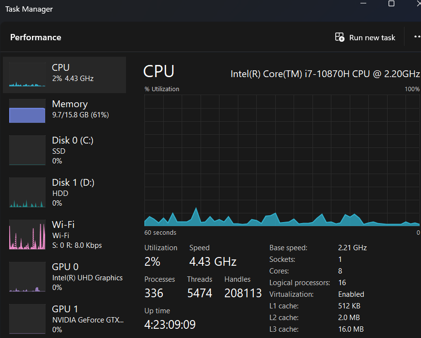

# Spark Installation on Windows

[Reference taken from](https://medium.com/geekculture/spark-how-to-install-in-5-steps-in-windows-10-9336f289139)

Spark version - 3.3.3

- Since spark runs on JVM, need to install java jdk of compatible version. 

- Set `JAVA_HOME` environment variable if not done already.

- Set `PATH = %PATH%;%JAVA_HOME%`

- Download spark(v3.3.3) & hadoop(v3.3.2) combine package from apache. Extract it in folder `D:\spark-setup\`
```bash
wget https://dlcdn.apache.org/spark/spark-3.3.3/spark-3.3.3-bin-hadoop3.tgz
```

- Download `winutils.exe` of compatible hadoop version which is Windows binaries to run Hadoop without actual its installation.

```bash
wget https://github.com/kontext-tech/winutils/blob/master/hadoop-3.3.1/bin/winutils.exe 
move winutils.exe D:\spark-setup\winutils.exe
```

- Set below environment variables
```bash
SET SPARK_HOME=D:\spark-setup\spark-3.3.3-bin-hadoop3
SET HADOOP_HOME=D:\spark-setup\spark-3.3.3-bin-hadoop3
SET PATH=%PATH%;%SPARK_HOME%;%SPARK_HOME%\bin
```

Spark is installed now. To use spark open its shell through cmd, run below commnand.
```bash
spark-shell
``` 

Above command will give following output. Notice it has created spark session as `spark` and spark context as `sc`.
Spark context shows spark application name and master node. And Spark web UI is hosted at http://AtulGi7:4040.


`local[*]` denotes it will utilize all avaiable vcores/logical processors of machine. If machine has 8 cores then generally it will have 8*2=16 vcores. Check your task manager as shown in below image. So, in this case default partitions will = 16.


 

Here you can use scala code. Use below code to create dummy RDD and see number of paritions created.
```scala
 val rdd=spark.sparkContext.parallelize(Seq(("Java", 20000),("Python", 100000),("Scala", 3000)))
 rdd.foreach(println)
 rdd.getNumPartitions
```

Now, Check spark web UI. It will show submited job `foreach`.


To exit from spark shell press `Ctrl + D`
